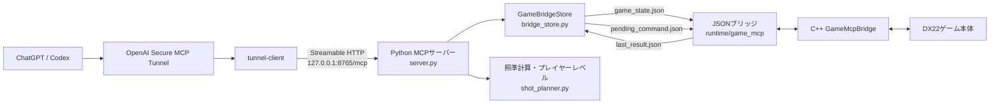
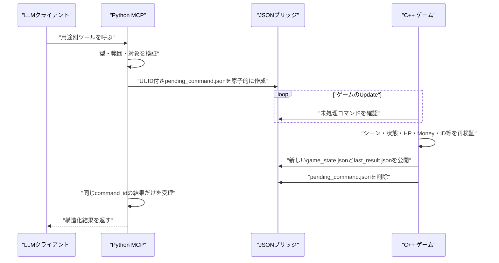

# DX22 Game MCP 実装・技術選択記録

最終確認日: 2026-07-29

この文書は、DX22のMCPサーバーが「何をしているか」だけでなく、
「なぜこの構成にしたか」「どの条件になったら別方式へ移行するか」を残すための
設計判断記録である。

## 1. 結論

現在の構成は、ローカルで動く1人用ゲームをChatGPT/Codexから安全に操作する
初期実装として妥当である。

設計の中心は次の3点にある。

1. MCPのプロトコル処理は公式Python SDKへ任せ、ゲーム固有処理だけを実装する。
2. MCPサーバーをゲームプロセスへ直接組み込まず、JSONファイルを境界にして分離する。
3. AIへ任意コードや任意座標を渡さず、用途別の狭いツールだけを公開し、
   最終的な状態変更可否はゲーム本体が再検証する。

この構成は、実装量、デバッグのしやすさ、ゲーム停止時の影響範囲、安全性の
バランスを優先している。一方で、JSONブリッジは高頻度・多重クライアント・
厳密なExactly-once実行には向かない。現在は「単一ゲーム、単一MCPサーバー、
人間が確認できる頻度の操作」という前提で採用している。

## 2. 全体構成



責務は次のように分けている。

| 層 | 主なファイル | 責務 |
|---|---|---|
| MCP公開層 | `server.py` | MCPツール定義、型付き入力、ツール注釈、構造化出力 |
| ゲーム連携層 | `bridge_store.py` | 状態の鮮度確認、コマンドの排他・採番・待機、JSONの原子的書き込み |
| 操作計画層 | `shot_planner.py`・`build_shot_evaluator.py` | 対象ID解決、直射・1回反射の照準計算、レベル別制約 |
| 行動方針 | `player_profiles.json` | 初心者・中級者・上級者の判断方針と許可範囲 |
| ゲーム側境界 | `GameMcpBridge.cpp/.h` | 状態公開、コマンド取得、シーン・資源・ゲーム状態の再検証、実処理 |
| 設定 | `assets/data/game_mcp_bridge.json` | 有効化、書き込み許可、ブリッジ場所、公開間隔 |
| 外部接続 | `init_secure_tunnel.cmd`、`start_secure_tunnel.cmd` | ローカルMCPを公開せずOpenAI製品へ接続 |
| 検証 | `test_*.py`、`smoke_test.py` | 単体テスト、ツールスキーマ、MCP初期化・疎通確認 |

## 3. 処理の流れ

### 3.1 状態取得

1. ゲームの `GameMcpBridge` が、既定では10フレームごとに
   `game_state.json` を更新する。
2. 状態にはシーン、戦闘状態、プレイヤー、敵、壁、デッキ、
   動的バランス、現在実行可能な操作などが含まれる。
3. MCPの `get_game_state` は状態を読み、次を確認する。
   - `running=true`
   - `published_at_unix_ms` が存在する
   - 既定で10秒以上古くない
4. MCPサーバーは敵個体へ `target_id` を補完し、現在の
   `mcp_control`（プレイヤーレベルと方針）を加えて返す。

状態に有効期限を設けた理由は、ゲームが終了・フリーズしたあとに残ったJSONを
「現在の状態」と誤認して操作しないためである。

### 3.2 状態変更



`GameBridgeStore` はプロセス内ロックを使い、同時に1件だけコマンドを送る。
既存の `pending_command.json` がある場合は上書きしない。
結果はUUIDの `command_id` が一致するものだけを受理する。

既定の待機時間は15秒で、50ミリ秒間隔で結果を確認する。タイムアウトしても
コマンドを取り消したことにはならず、ゲームが後から実行する可能性がある。
したがって、タイムアウト後は同じ操作をすぐ再送せず、必ず
`get_game_state` で結果を確認する。

この方式が保証するのは「単一保留と応答の相関」であり、
分散システム上の厳密なExactly-once実行ではない。

### 3.3 ショット計画

`fire_shot` は自由な `direction_x` / `direction_z` をMCPツールの引数として
公開しない。クライアントが指定できるのは、敵個体の `target_id`、パワー、
直射か1回反射か、使用する壁である。

- `target_id`: その時点の敵個体を識別する `enemy:0` 形式のID
- `enemy_id`: 敵の種類ID。同種の敵が複数いると重複するため照準には使わない
- `auto`: ボールの特性と配置から、接触点・パワー・直射/1回反射を比較
- `direct`: 対象に届く中心またはずらした接触点への正規化方向を計算
- `bank`: 対象を壁に対して鏡映し、壁との交点を求める
- `wall_index=-1`: 有効な経路をビルド別のダメージ・制御・生存評価で比較する

反射点は壁端から最大1.0、または壁長の10%分を避ける。これは壁端や
ポケット開口部付近の不安定な反射を避けるためである。

初心者は直射のみ、中級者と上級者は1回反射を使える。レベル別方針を
JSONへ分離したことで、プロトコル実装を変更せずにAIの振る舞いを調整できる。

2026-09-03から`build_shot_evaluator.py`で候補ごとの幾何評価を共有している。
推奨ボールと実行するボールを一致させるため、収集器は持ち替え後に状態を再取得する。
推定は無制限の連鎖を扱わず、`estimate_only`と評価内訳を返す。詳細な評価軸と制約はREADMEを参照。

### 3.4 動的バランス

動的バランスの評価と敵ステータスへの反映はMCPサーバーではなくゲーム本体が
担当する。MCPは状態の表示と、有効・無効、リセット、開始レベルの変更だけを
仲介する。

この配置にした理由は次のとおり。

- MCPやChatGPTが接続されていなくてもゲーム規則が成立する
- 戦闘中に外部処理の都合で敵ステータスが変わらない
- セーブデータやゲームループに近い場所を正とできる
- AIは提案・操作側に留まり、難易度計算の権限を持たない

変更は戦闘中の敵ではなく、次に生成される敵へ適用する。

## 4. 公開ツールと権限

| 種類 | ツール | 扱い |
|---|---|---|
| 読み取り | `get_game_state` | `readOnlyHint=true` |
| サーバー内設定 | `set_player_level` | 実行中プロセスだけを変更 |
| ゲーム設定 | `set_dynamic_balance` | ゲーム側で範囲を再検証 |
| 進行 | `choose_destination`、`continue_to_battle`、`continue_after_reward` | 現在シーンで許可された場合だけ実行 |
| 戦闘 | `select_ball`、`fire_shot` | 照準待ち・停止中などを再検証 |
| 回復・成長 | `heal`、`upgrade_ball`、`choose_reward` | HP、ID、強化可否などを再検証 |
| 破壊的 | `start_new_run`、`remove_ball` | `destructiveHint=true`、ユーザー確認を前提 |

すべて `openWorldHint=false` であり、任意ファイル、任意URL、任意コマンドを
扱うツールは公開していない。

ツール注釈はクライアントへ意図を伝えるための情報であり、セキュリティ境界
そのものではない。実際の防御は、ツールの狭い入力、Python側の検証、
ゲーム側の再検証で行う。

## 5. 技術選択と比較

### 5.1 MCPを選んだ理由

| 選択肢 | 長所 | 短所 | 今回の判断 |
|---|---|---|---|
| MCP | ツール探索、JSON Schema、注釈、構造化結果を標準化でき、複数のLLMクライアントから利用しやすい | MCPのライフサイクルとSDK依存が増える | 採用。ChatGPT/Codexへゲーム操作を公開する目的に直接合う |
| 独自REST API | 一般的でデバッグしやすい | LLM用のツール定義・スキーマ・承認情報を別実装する必要がある | ゲーム専用Web APIが主目的なら候補だが、今回は重複実装が多い |
| WebSocket独自プロトコル | 双方向・低遅延 | 接続管理、再接続、メッセージ仕様、クライアント実装が必要 | リアルタイム遠隔操作が必要になった場合だけ検討 |
| OpenAI APIのFunction Callingへ直結 | 1つのアプリ内では単純 | ChatGPT/Codexから共通利用しにくく、アプリ側がモデル呼び出しも所有する | モデル実行までゲーム側で管理する製品なら候補 |

MCPを使うことで、ゲーム側は「どのモデルを使うか」ではなく
「どの操作を安全に公開するか」へ集中できる。

### 5.2 Python公式SDK / FastMCPを選んだ理由

| 選択肢 | 長所 | 短所 | 今回の判断 |
|---|---|---|---|
| Python公式MCP SDK | 型ヒントからスキーマを生成でき、試作・テストが速い。照準計算やJSON処理も簡潔 | Pythonランタイムと別プロセスが必要 | 採用。最小の実装量で公式プロトコルへ追従できる |
| TypeScript公式SDK | Web系運用、Node.jsツールとの統合に強い | 現プロジェクトにNode.jsアプリ基盤がなく、導入対象が増える | Web管理画面や既存TS基盤ができたら再検討 |
| C++へMCPを直接実装 | 単一プロセス、IPC不要、低遅延 | JSON-RPC、HTTP、セッション、SDK更新の影響をゲーム本体が受ける。クラッシュ境界も共有 | 不採用。ゲームループと外部プロトコルを分離する利点を優先 |
| Go/Rustサーバー | 配布しやすく並行処理・常駐運用に強い | 現在の小規模ローカル用途には実装・ビルド基盤が過剰 | 長期常駐サービス化するときの候補 |

現在は `mcp==1.28.1` を完全固定しているため、再現性は高い。
一方、2026-07-28仕様に対応するPython SDK v2が現在の安定版となり、
v1系は保守ラインである。現状を直ちに壊してまで上げる必要はないが、
新機能追加前にv2移行用ブランチでスキーマと疎通を検証するべきである。

### 5.3 Streamable HTTPを選んだ理由

| 選択肢 | 長所 | 短所 | 今回の判断 |
|---|---|---|---|
| Streamable HTTP | 標準のリモート向け通信。単一 `/mcp` エンドポイントで、InspectorとTunnelに接続しやすい | HTTPサーバーのプロセス管理が必要 | 採用。ローカル検証とSecure Tunnelを同じ接続方式にできる |
| stdio | ポート不要。クライアントが子プロセスとして起動する用途に簡単 | ゲーム・MCP・ChatGPT Tunnelを個別起動する現在の運用と合わせにくい | ローカルCodex専用なら有力 |
| 旧HTTP+SSE | 既存クライアントとの互換性 | Streamable HTTPに置き換えられた旧方式 | 新規実装では選ばない |

MCP仕様では、Streamable HTTPは独立プロセスとして複数接続を扱う標準方式である。
今回のサーバーは `127.0.0.1` にのみバインドし、外部接続はTunnelへ任せる。

### 5.4 JSONファイルブリッジを選んだ理由

| 選択肢 | 長所 | 短所 | 今回の判断 |
|---|---|---|---|
| JSONファイル | C++とPythonの依存を分離し、目視・保存・再現が容易。追加ライブラリ不要 | ポーリング遅延、単一コマンド、クラッシュ残骸、厳密な配送保証が弱い | 採用。低頻度のターン制操作に十分 |
| localhost HTTPをゲームへ組み込む | リクエスト・応答が明確 | C++側へHTTPサーバー、スレッド、ポート・セキュリティ管理が必要 | ゲーム本体の複雑化を避けて不採用 |
| Named Pipe / Unix Socket | ローカル限定、低遅延、双方向 | Windows固有実装またはOS差分、デバッグがJSONより難しい | 操作頻度が上がったら候補 |
| SQLite | トランザクション、履歴、複数レコードに強い | スキーマ管理とDBアクセスが増える | コマンド履歴や再送管理が必要になったら候補 |
| Redis / メッセージキュー | 多重ワーカー、Ack、監視、拡張性 | 別サービスが必要でローカルゲームには過剰 | サーバー運営・複数ゲーム化したら候補 |
| 共有メモリ | 最低遅延 | 同期・破損・デバッグ・言語境界が難しい | フレーム単位制御が必要な用途以外では選ばない |

JSON書き込みは一時ファイルを完成させてから置き換える。読み手が途中までのJSONを
読む確率を下げるためである。Python側は `os.replace` と `fsync` を使用し、
結果読取時は短いリトライも行う。

### 5.5 Secure MCP Tunnelを選んだ理由

| 選択肢 | 長所 | 短所 | 今回の判断 |
|---|---|---|---|
| OpenAI Secure MCP Tunnel | 受信ポートや公開URLが不要。ローカルサーバーを `127.0.0.1` のままChatGPT/Codexへ接続できる | `tunnel-client` の常駐、OpenAI側の権限・トンネル設定が必要 | 採用。開発PC上の非公開ゲームに最も合う |
| 公開HTTPS + OAuth | 標準的で任意MCPクライアントから到達可能 | ドメイン、TLS、認証、WAF、更新、監視を自前運用する必要がある | 複数利用者向けサービスになったら候補 |
| Cloudflare Tunnel等 | 受信ポートを開けず公開URLを作れる | MCP認証と公開面の保護を別途設計する必要がある | OpenAI以外のクライアントも必要な場合に検討 |
| VPN / Tailscale | 私設ネットワーク内では安全 | ChatGPTのクラウド実行環境からそのVPNへ直接参加させにくい | 人間や社内サービス間の接続向け |
| クラウドへMCPを配置 | 常時稼働とスケールに向く | ローカルで実行中のゲーム状態へ届かない。ゲームもクラウド化する必要がある | 将来ゲームセッション自体をサーバー化した場合の候補 |

Secure MCP Tunnelは、内部ホストからOpenAIへoutbound HTTPSを開始し、
受け取ったJSON-RPCをローカルMCPへ転送する。そのため、ゲームPCへ
インターネットからの受信経路を作らずに済む。

### 5.6 狭い用途別ツールを選んだ理由

`execute_command(name, arguments)` のような万能ツールや、任意のショット方向を
受け取るツールは実装が短いが、LLMへ与える権限が広すぎる。

現在は `heal`、`upgrade_ball`、`fire_shot` のように目的ごとに分けている。
これにより、型、説明、破壊性、利用条件を操作ごとに表現できる。
追加の実装量よりも、誤操作時の影響範囲を小さくすることを優先した。

## 6. 安全設計

現在入っている主な防御は次のとおり。

- MCP HTTPサーバーの既定バインド先は `127.0.0.1`
- ChatGPT接続は受信ポートを作らないSecure MCP Tunnel
- API keyとTunnel IDをリポジトリへ保存せず、実行中の環境変数で渡す
- `allow_write_actions` でゲーム側から書き込み全体を停止可能
- `available_actions` で現在実行可能な操作を明示
- 読み取り、通常変更、破壊的変更のツール注釈
- Pydanticと型ヒントによる入力スキーマ
- パワー、ID、対象、有限数値、反射経路をPython側で検証
- シーン、ゲーム状態、HP、Money、デッキ数などをゲーム側で再検証
- 状態の鮮度確認
- UUIDによるコマンドと結果の相関
- 一時ファイル経由のJSON更新
- 任意ファイル、任意URL、任意コード実行を非公開

## 7. 既知の制約と注意点

### 7.1 ローカルMCPエンドポイント自体には認証がない

`127.0.0.1` 限定かつTunnel内側で使う前提では簡潔で合理的である。
ただし `--host 0.0.0.0` などへ変更すると、現状はOrigin検証やOAuthがないため
安全ではない。非ループバックで運用する場合は、認証、Origin検証、TLS、
ネットワークACLを追加する。

### 7.2 タイムアウトはキャンセルではない

15秒でMCP呼び出しがタイムアウトしても、保留ファイルは残り、ゲームが後から
処理する可能性がある。再送による二重操作を避けるには、状態再取得が必要である。

### 7.3 排他は1つのPythonプロセス内だけ

`threading.Lock` は複数のMCPサーバープロセスをまたがない。
複数サーバーを同じブリッジへ接続してはいけない。必要になったらOSファイルロック、
SQLiteトランザクション、Named Pipeなどへ移行する。

### 7.4 ゲーム側のショット再検証には差がある

ゲーム側は、戦闘中か、ボールが停止しているか、方向が有限で非ゼロか、
パワーが有限かを再検証する。一方、現在のC++側は `target_id` と
`shot_type` を実行時の敵・壁へ再照合せず、Pythonが計算した方向を使用する。

通常のMCP経路ではPython側が対象を検証するため成立するが、ローカルの別プロセスが
`pending_command.json` を直接作れる脅威まで防ぐ設計ではない。より強い境界が必要なら、
ゲーム側でも対象ID、生存状態、ショット種別、壁番号を検証し、方向を再計算する。

### 7.5 敵個体IDは列挙順に依存する

`target_id` は現在 `enemy:<index>` で、Python側も互換性のため毎回同じ形式へ
補完する。戦闘中に敵配列の並び順を変更する実装へ移行する場合は、
生成時に割り当てる不変の個体IDへ変更する。

### 7.6 JSONブリッジは永続キューではない

保留できるコマンドは1件で、履歴、Ack再送、期限、優先度はない。
ターン制ゲームには十分だが、自動連続操作や複数セッション運営には不足する。

### 7.7 ファイル置換中の読み取り競合

C++実装はWindowsの置換APIで既存ファイルを直接差し替える。Python側も状態と
結果の読み取りを短時間再試行し、置換中の共有違反、一時欠落、不完全なJSONを
MCPツールの一時エラーとして露出させない。

### 7.8 SDK v1を固定している

`mcp==1.28.1` は現在も動作するが、公式Python SDKの現行安定系列はv2で、
v1は保守系列である。完全固定は再現性には有利だが、セキュリティ修正の自動取得や
新仕様追従はしない。更新は自動ではなく、テスト付きの明示的な作業として行う。

## 8. 運用手順

### 初回

```bat
tools\game_mcp\setup_game_mcp.cmd
```

### ローカル起動

```bat
tools\game_mcp\start_game_mcp.cmd
```

エンドポイントは `http://127.0.0.1:8765/mcp`。

### 単体テスト

```bat
tools\game_mcp\.venv\Scripts\python.exe -m unittest ^
  tools\game_mcp\test_bridge_store.py ^
  tools\game_mcp\test_shot_planner.py ^
  tools\game_mcp\test_server_schema.py -v
```

### MCP疎通

```bat
tools\game_mcp\.venv\Scripts\python.exe tools\game_mcp\smoke_test.py
```

ゲーム状態も読む場合:

```bat
tools\game_mcp\.venv\Scripts\python.exe tools\game_mcp\smoke_test.py --read-game-state
```

### Tunnel

```bat
set CONTROL_PLANE_API_KEY=取得したruntime API key
set GAME_MCP_TUNNEL_ID=tunnel_xxxxxxxxx
tools\game_mcp\init_secure_tunnel.cmd
tools\game_mcp\start_secure_tunnel.cmd
```

`doctor --explain` を通したうえで、現在の `tunnel-client` が提供する
`/readyz`、`/ui`、`/metrics` も確認する。起動しただけでなく、
ready状態になっていることを成功条件とする。

## 9. 今後の変更判断

### 現在のまま維持してよい条件

- 1台のPCで1つのゲームと1つのMCPサーバーを動かす
- 操作頻度が人間のターン操作程度
- 数十ミリ秒から数百ミリ秒のIPC遅延が問題にならない
- ChatGPT/Codexからの非公開接続が主目的
- ローカルPC上の他プロセスを信頼境界内とみなせる

### 移行を検討する条件

| 条件 | 推奨する次の方式 |
|---|---|
| 連続的・フレーム単位の操作が必要 | Named Pipe、ローカルSocket、共有メモリ |
| 複数MCPクライアント・複数ゲームを扱う | SQLiteキュー、Redis、専用セッションサービス |
| 厳密な再実行防止が必要 | 期限、状態シーケンス前提条件、永続Idempotency記録を持つコマンドキュー |
| 公開サービスとして運営する | 公開HTTPS、OAuth 2.1、監視、監査ログ、レート制限 |
| ゲームとMCPを一体配布したい | stdio子プロセス、またはC++/Goへの統合を再評価 |
| OpenAI以外のリモートクライアントも必要 | 認証付き公開MCP、または別の安全な公開トンネル |

## 10. 推奨する改善順

1. `target_id`、`shot_type`、`wall_index` をゲーム側でも再検証する。
2. コマンドへ有効期限と要求元の `state_sequence` を追加し、
   古い状態を前提にした操作を拒否する。
3. `--host` がループバック以外の場合は、認証・Origin設定なしで起動しない
   ガードを追加する。
4. C++側の状態ファイル置換とPython側の状態読取リトライを強化する。
5. Python SDK v2移行を別作業として行い、ツールスキーマ、Inspector、
   Tunnel、全単体テストを比較する。
6. Tunnelの `/readyz` とMCPスモークテストを起動確認手順へ組み込む。
7. 多重プロセスが必要になった時点でJSON単一スロットを卒業する。

## 11. 設計判断ログ

### ADR-001: ゲーム本体とMCPサーバーを別プロセスにする

- 状況: 外部プロトコルの障害をゲームループへ持ち込みたくない。
- 決定: C++ゲームとPython MCPをJSONブリッジで分離する。
- 結果: デバッグと差し替えが容易になる一方、ポーリングと整合性管理が必要になる。
- 再検討条件: 遅延がゲーム体験へ影響する、または一体配布が必須になる。

### ADR-002: ゲーム本体を状態変更の最終権限者にする

- 状況: LLMの判断や古い状態をそのまま信頼できない。
- 決定: Python側で事前検証し、C++側でシーン・資源・状態を再検証する。
- 結果: 誤操作に強くなるが、検証規則を両層で保守する必要がある。
- 再検討条件: なし。通信方式を変えても維持すべき原則である。

### ADR-003: Streamable HTTPをローカルMCP通信に使う

- 状況: Inspector、ChatGPT、Codex、Tunnelから同じサーバーを使いたい。
- 決定: `127.0.0.1:8765/mcp` のStreamable HTTPを使う。
- 結果: 接続方法を統一できる。非ループバック公開時は認証が別途必要になる。
- 再検討条件: クライアントが常にローカル子プロセスとして起動する構成へ変わる。

### ADR-004: 外部接続にSecure MCP Tunnelを使う

- 状況: ChatGPTからlocalhostへ直接接続できず、ゲームPCを公開したくない。
- 決定: outbound-onlyのSecure MCP Tunnelを使う。
- 結果: 受信ポート不要になる。Tunnel権限と常駐クライアントの運用が必要になる。
- 再検討条件: OpenAI以外の利用者、独自SLA、常時公開サービスが必要になる。

### ADR-005: 万能コマンドではなく用途別ツールを公開する

- 状況: LLMへ与える権限と誤操作の影響を限定したい。
- 決定: ゲーム操作ごとに型付きツールを定義する。
- 結果: ツール数は増えるが、説明、承認、入力制約、テストを個別に持てる。
- 再検討条件: 原則として維持する。操作追加時も万能ツールへ戻さない。

## 12. 参照資料

### 2026-09-04追記：Armorボスのショット判断

Armorボス戦の候補生成・採点はゲーム側 `GameBossAI.cpp` に置き、実プレイと共通のCCD予測を呼び出す。C++自動操作とMCPは同じ候補を使う。Python側は状態の検査・表示・候補IDの送信を担当し、独自の物理近似を重ねない。通常戦・中ボス戦は既存の評価経路を保つ。

`evaluate_boss_shots` は実世界を変更しない問い合わせ。`fire_boss_shot` は `candidate_id` と `state_key` を検証し、選択球と予測時の速度をまとめて適用する。同一性能の球は計算を共有しつつ、個体IDは維持する。古い候補の自動再試行はしない。

1ショットの物理結果と、次の押しやすさ・敵ターン被害の推定を別項目として公開する。比較時は照準誤差を加えない。旧 `fire_shot` もボス戦では同じ候補を利用するため、ツール一覧が更新されていないクライアント向けの互換経路になる。稼働中サーバーのコード更新には再起動が必要。

- [MCP公式仕様: Transports](https://modelcontextprotocol.io/specification/draft/basic/transports)
- [MCP公式Python SDK](https://github.com/modelcontextprotocol/python-sdk)
- [OpenAI: Secure MCP Tunnel](https://developers.openai.com/api/docs/guides/secure-mcp-tunnels)
- [OpenAI tunnel-client](https://github.com/openai/tunnel-client)
